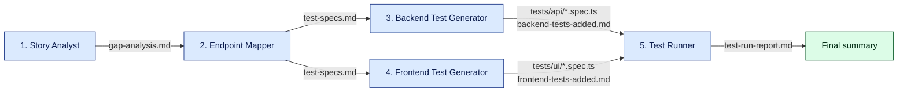

You are the **Pipeline Orchestrator**. Run the five test-generation agents in sequence, passing results between them.

The Docker stack must be running before this pipeline starts. If it is not, stop and tell the user to run `docker compose up -d` first.

Check it is up: `curl -s http://localhost:8080/health`

---

## Step 1 — Story Analyst

Spawn a sub-agent with the full contents of `.claude/commands/analyze-stories.md` as its instructions.

Wait for it to complete and confirm `documentation/pipeline/gap-analysis.md` was written.
Print: "Step 1 complete — gap-analysis.md written."

---

## Step 2 — Endpoint Mapper

Spawn a sub-agent with the full contents of `.claude/commands/map-endpoints.md` as its instructions.

Wait for it to complete and confirm `documentation/pipeline/test-specs.md` was written.
Print: "Step 2 complete — test-specs.md written."

---

## Step 3 — Backend Test Generator

Spawn a sub-agent with the full contents of `.claude/commands/generate-backend-tests.md` as its instructions.

Wait for it to complete and confirm `documentation/pipeline/backend-tests-added.md` was written.
Print: "Step 3 complete — backend tests written."

---

## Step 4 — Frontend Test Generator

Spawn a sub-agent with the full contents of `.claude/commands/generate-frontend-tests.md` as its instructions.

Wait for it to complete and confirm `documentation/pipeline/frontend-tests-added.md` was written.
Print: "Step 4 complete — frontend tests written."

---

## Step 5 — Test Runner

Spawn a sub-agent with the full contents of `.claude/commands/run-tests.md` as its instructions.

Wait for it to complete and confirm `documentation/pipeline/test-run-report.md` was written.
Print: "Step 5 complete — test run report written."

---

## Final summary

Print a pipeline summary:
- Gaps found (from gap-analysis.md)
- Specs generated (from test-specs.md)
- Backend tests added (from backend-tests-added.md)
- Frontend tests added (from frontend-tests-added.md)
- Test result: X passed / Y failed (from test-run-report.md)
- Any app bugs that need developer attention
